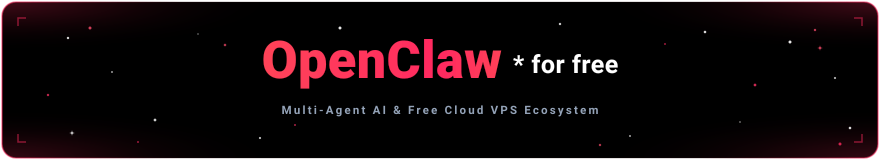

# OpenClaw-for-free: Multi-Agent AI & Free Cloud VPS System

<p align="center">
  
</p>

<p align="center">
  A production-grade, unified multi-agent ecosystem running across <b>cloud VPS containers (Daytona Cloud &amp; Freestyle.sh)</b>, coupled with <b>Railway edge relays</b>, <b>OmniRoute multi-provider LLM multiplexer</b>, <b>OpenClaw autonomous agent runtime</b>, <b>dedicated secondary LLM inference VMs (llama.cpp)</b>, and the <b>Unified Modern TUI Control Panel</b>.
</p>
<p align="center">
  <a href="https://www.gnu.org/licenses/gpl-3.0"></a>
  <a href="https://nodejs.org/"></a>
  <a href="https://www.typescriptlang.org/"></a>
  <a href="https://openclaw.ai"></a>
  <a href="https://www.daytona.io/"></a>
  <a href="https://freestyle.sh/"></a>
  <a href="https://railway.app/"></a>
  <a href="https://github.com/IMROVOID/OpenClaw-for-free/actions/workflows/ci.yml"></a>
</p>

<p align="center">
  <a href="#getting-started">Quick Start</a> ·
  <a href="docs/Readme.md">Documentation Catalog</a> ·
  <a href="docs/CONTRIBUTING.md">Contributing</a> ·
  <a href="docs/RUNBOOK.md">Runbook</a> ·
  <a href="docs/ControlPanelTui.md">TUI Manual</a> ·
  <a href="docs/TelegramBotAssistant.md">Telegram Bot Manual</a> ·
  <a href="#architecture-and-structure">Architecture</a> ·
  <a href="#copyright-gpl3">License</a>
</p>

## Table of Contents

1. [About Project and what is it for](#about-project-and-what-is-it-for)
2. [Key Features](#key-features)
3. [Getting started](#getting-started)
4. [Architecture and Structure](#architecture-and-structure)
5. [Detailed Tech Stack](#detailed-tech-stack)
6. [other Guides including running automated tests](#other-guides-including-running-automated-tests)
7. [Contributing & Runbook](#contributing--runbook)
8. [Copyright (GPL3)](#copyright-gpl3)

## What is OpenClaw-for-free?

**OpenClaw-for-free** is a turnkey, self-healing deployment framework and control station for autonomous AI agents. It bridges high-capacity free cloud VPS infrastructure (Daytona Cloud, Freestyle.sh, etc.) with personal workstations:

1. **Eliminates Local Resource Strain**: Runs compute-intensive autonomous agents (OpenClaw) and local LLM inference engines (`llama.cpp`) on remote, low-cost cloud VPS containers (Daytona Cloud or Freestyle.sh), freeing local workstation CPU and RAM.
2. **Overcomes Cloud Container Limitations**: Solves hypervisor-level egress firewall blocks (e.g. Daytona port filtering and Envoy Layer-7 RST packets on Discord/API gateways) via lightweight edge relays hosted on Railway.
3. **Unified Multi-Provider Gateway**: Routes all model queries through OmniRoute, giving agents transparent access to 500+ cloud models (Gemini, Claude, GPT, DeepSeek) and self-hosted GGUF models under unified OpenAI-compatible endpoints with automated fallback.
4. **Single-Pane-of-Glass Management**: Provides an interactive, modern Terminal User Interface (TUI) with mouse support, multi-server SSH tunneling, daemon supervision, real-time log streaming, and automated container provisioning.
5. **Multi-User Isolation**: Supports concurrent Telegram and Discord bot access where every user receives an isolated conversational session, memory space, and context buffer.

## Key Features

### 1. Unified Modern TUI Control Panel (`OpenClaw-Control-Panel.exe`)

- **SGR Extended Mouse & Keyboard Navigation**: Full support for left-clicking menu cards, scroll wheel navigation, and keyboard shortcuts (`↑`/`↓`, `1`-`9`, `ESC`).
- **Two-Column Aligned Status Table**: Real-time service monitoring (`OpenClaw`, `OmniRoute`, `Llama`, `Railway Relay`) with fixed 23-character labels and an initial `[DETECTING...]` lifecycle to prevent false offline alerts.
- **Component Autodetection & Auto-Login**: Automatically scans remote instances for OpenClaw and OmniRoute; skips onboarding and boots straight to the Main Menu in `< 1 second` once configured.
- **Stale Port Cleanup**: Automatically detects and terminates orphaned local `ssh.exe` processes holding ports `18789`, `20128`, or `8080`.
- **Dedicated SSH Terminal**: Launches an independent Windows terminal window connected to the remote VPS with 1 keystroke (`[7]`), preserving the TUI's raw mode.
- See detailed operational guide: **[docs/ControlPanelTui.md](docs/ControlPanelTui.md)**.

### 2. Multi-Cloud VPS Provisioning (Daytona Cloud & Freestyle.sh)

- **Daytona Cloud Driver**: Automated workspace creation via Daytona REST API, quota enforcement, and container hardware limits clamping (**max 4 vCPU, 8 GB RAM, 10 GB Storage**). Handles 48-core host node detection to prevent CPU allocation overruns.
- **Freestyle.sh Driver**: Native integration with Freestyle.sh containers offering **32 GB storage** and unrestricted outbound internet egress.
- **Dedicated Secondary LLM VM Topology**: Supports deploying `llama-server` on a dedicated secondary VM (Freestyle 32GB direct egress or Daytona 10GB with Railway relay) to eliminate CPU/RAM contention with agent runtimes.

### 3. Hugging Face Model Inspector & Upstream Key Validator

- **Hugging Face Model Inspector (`huggingfaceInspector.ts`)**: Queries HF repo APIs live, parses all available GGUF quantization formats (IQ3_M, Q4_K_M, etc.), calculates memory footprints against the 8GB cgroup ceiling, and validates MTP speculative drafting heads.
- **Pre-Flight Key Validator (`providerValidator.ts`)**: Live verification of API keys against upstream providers (OpenAI, Anthropic, Gemini, DeepSeek, Groq, OpenRouter) before writing configurations.

### 4. Edge Relays & Firewall Egress Bypass

- **Gateway Egress Relay (`railway-gateway-relay`)**: Encrypted Xray VLESS over WebSocket/TLS (port 443) deployed on Railway, bypassing Daytona hypervisor blocks for Discord Gateway, Cloudflare edge networks, and external APIs.
- **Llama SSE Streaming Proxy (`railway-llama-relay`)**: High-performance Node.js streaming reverse proxy with zero socket timeouts (`server.setTimeout(0)`) and universal CORS, exposing private Daytona preview ports as standard OpenAI endpoints.
- **Unified Web Ingress Relay (`railway-web-relay`)**: High-performance Node.js streaming reverse proxy providing single permanent URLs for OpenClaw (`:18789`), OmniRoute (`:20128`), and LLaMA WebUIs (`:8080`) on Daytona Cloud.
- See detailed relay blueprints: **[docs/RailwayRelayManual.md](docs/RailwayRelayManual.md)** and **[docs/DaytonaNetworkEgress.md](docs/DaytonaNetworkEgress.md)**.

### 5. Permanent Domained URLs & Unified Web Ingress (Zero Port Forwarding)

- **Eliminates Local Port Forwarding**: Expose OpenClaw (`/openclaw`), OmniRoute (`/omniroute`), and LLaMA WebUIs (`/llama`) behind single permanent HTTPS URLs accessible from any mobile device, Telegram WebApp, or web browser.
- **FreeStyle.sh Native Domains (0% Railway)**: Leverage FreeStyle's built-in `<slug>.style.dev` domains and direct egress using automated Caddy edge reverse proxy with automatic Let's Encrypt TLS.
- **Daytona Cloud Ingress**: Hosted via `railway-web-relay` on Railway to seamlessly bypass Daytona container port isolation and preview cookie walls.
- **Provider Requirement Matrix**:
  - **Daytona Cloud**: Railway is **REQUIRED** across all setups (Egress Relay for OmniRoute providers/Cloudflare edge IPs/Discord; Web Relay for Domained URLs; Llama SSE Relay for Dedicated Secondary VM).
  - **FreeStyle.sh**: Railway is **OPTIONAL** (100% native with FreeStyle domains, 32GB disk, and direct internet egress).
- **Optional Local Port Forwarding**: Users who prefer local SSH port forwarding (`ssh -L ...`) can keep using it anytime with full fallback commands.
- See detailed guide: **[docs/PublicWebIngressAndDomains.md](docs/PublicWebIngressAndDomains.md)**.

### 6. Proactive Context Compaction & Memory Safeguards

- **True Maximum Contexts**: Configured to model physical limits (Gemini 2M tokens, Claude 200k tokens, DeepSeek 1M tokens, Local Llama 32k tokens).
- **Cloud Delegation**: When context pressure triggers, summarization is delegated to `omniroute/auto/best-chat` (completing in ~2s in the cloud) rather than choking the local 4-vCPU instance.
- **Verbatim Retention**: Retains the latest **30,000 tokens** and **6 conversation turns verbatim**.
- See runtime manual: **[docs/OpenclawManual.md](docs/OpenclawManual.md)**.

### 7. Standalone GrammY Telegram Bot Assistant (`src/telegram-bot/`)

- **Exact Workflow Replication**: Replicates the entire TUI and Bash script lifecycle (Main Menu dashboard, 7-step onboarding wizard, VM recovery flows, service manager, hardware telemetry) directly inside Telegram.
- **Interactive Inline Keyboards**: Provides 1-tap buttons for service management (`start`, `stop`, `restart`, `update`), tailing live VPS logs, and triggering live API latency pings.
- **Owner Security Gate**: Protects remote infrastructure via Telegram User ID authorization (`TELEGRAM_OWNER_ID`), locking administrative commands against unauthorized access.
- **Shared Domain Architecture**: Directly reuses core drivers (`DaytonaApi`, `FreestyleApi`, `VpsProbe`, `ServiceController`, `OmnirouteSync`, `OpenclawConfigSyncer`) for maximum reliability and zero logic divergence.
- See detailed manual: **[docs/TelegramBotAssistant.md](docs/TelegramBotAssistant.md)**.

## Getting started

You can run OpenClaw-for-free via any of the following methods:

### Method 1: Public Telegram Installation Bot (Recommended)

The easiest, zero-setup way to install, provision, and operate your entire OpenClaw-for-free cloud infrastructure directly from Telegram without installing Node.js, compiling binaries, or configuring local terminals:

- **Official Bot**: [@openclaw4free_bot](https://t.me/openclaw4free_bot)
- **Zero Local Footprint**: No local dependencies required. Run entirely from your phone, tablet, or desktop Telegram app.
- **Full Cloud Provisioning**: 1-click provisioning for Daytona Cloud and Freestyle.sh containers, automated SSH key configuration, upstream AI provider validation, background service management, live VPS log streaming, and diagnostics.

👉 **Start Now**: Open **[@openclaw4free_bot](https://t.me/openclaw4free_bot)** on Telegram and press `/start`.

### Method 2: 1-Line Automated Installer

The fastest local installation method to download and launch the OpenClaw-for-free Control Panel:

- **Windows (PowerShell)**:

  ```powershell
  irm https://raw.githubusercontent.com/IMROVOID/OpenClaw-for-free/main/install.ps1 | iex
  ```

- **macOS / Linux (Bash)**:

  ```bash
  curl -fsSL https://raw.githubusercontent.com/IMROVOID/OpenClaw-for-free/main/install.sh | bash
  ```

This automatically verifies your environment (e.g. OpenSSH client), downloads the latest binary into user-space, configures your PATH, creates a desktop launcher, and boots the Unified Control Panel immediately.

### Method 3: Zero-Install NPX Runner (Cross-Platform)

Requires Node.js 22 LTS (v18+ also supported). Run instantly without manual installation:

```bash
npx openclaw-for-free
```

### Method 4: Desktop Executable (Standalone Binary)

1. Download or locate `OpenClaw-Control-Panel.exe` in the `bin/` directory (or your Desktop).
2. Double-click `OpenClaw-Control-Panel.exe`.
3. If running for the first time, the guided Setup Assistant will prompt for your cloud credentials:
   - **Daytona API Key** (or existing SSH target)
   - **Telegram Bot Token** (from `@BotFather`)
   - **Upstream AI Provider Keys** (OpenAI, Anthropic, Gemini, etc.)
4. Once verified, the TUI boots immediately into the Main Menu.

### Method 5: Running from Source (Node.js 22 LTS)

```bash
# Clone the repository
git clone https://github.com/IMROVOID/OpenClaw-for-free.git
cd OpenClaw-for-free

# Verify TypeScript types
npm run typecheck

# Launch the Unified Control Panel TUI
npm start
# Alternatively: npx tsx src/control-panel/index.ts

# Run the 45-module automated test suite
npm test
# Alternatively: npm run test:all
```

### Method 6: Run the Telegram Bot Yourself (Self-Hosted Assistant)

Control and provision Daytona and Freestyle cloud environments directly from your own dedicated, self-hosted Telegram bot:

```bash
# Set your BotFather token and owner ID
export TELEGRAM_BOT_TOKEN="123456789:your_telegram_bot_token_from_botfather"
export TELEGRAM_OWNER_ID="123456789"

# Start Telegram Bot Assistant
npm run start:bot
# Alternatively: npx tsx src/telegram-bot/index.ts
```

For detailed installation and operational options, see **[docs/InstallationGuide.md](docs/InstallationGuide.md)**, **[docs/CONTRIBUTING.md](docs/CONTRIBUTING.md)**, and **[docs/TelegramBotAssistant.md](docs/TelegramBotAssistant.md)**.

## Architecture and Structure

### Physical & Cloud Infrastructure Topology

```text
┌────────────────────────────────────────────────────────────────────────────────────────┐
│                                   SYSTEM ARCHITECTURE                                  │
│                                                                                        │
│   ┌────────────────────────────────────────────────────────────────────────────────┐   │
│   │                 PRIMARY CLOUD VPS: OPENCLAW AGENT & OMNIROUTE                  │   │
│   │             (Daytona Cloud or Freestyle.sh Ubuntu 22.04 Container)             │   │
│   │                                                                                │   │
│   │   [Supervisord]                                                                │   │
│   │      ├── OpenClaw Gateway     (Port 18789 / Loopback)                          │   │
│   │      ├── OmniRoute AI Router  (Port 20128 / 0.0.0.0, Multi-Provider)           │   │
│   │      └── Xray Egress Daemon   (Port 10808 HTTP / 10809 SOCKS5, Daytona only)   │   │
│   │                                                                                │   │
│   │   Channels:                                                                    │   │
│   │      • Telegram Bot: Native Long-Polling (Isolated user sessions)              │   │
│   │      • Discord Bot:  Proxied via 127.0.0.1:10808 (Bypasses firewall)           │   │
│   └──────────────────────┬───────────────────────────────────▲─────────────────────┘   │
│                          │                                   │                         │
│           Egress to Discord / Inception                      │ LLM Inference Calls     │
│                          ▼                                   │ (HTTP 200 SSE Stream)   │
│   ┌──────────────────────────────────────────────┐           │                         │
│   │           RAILWAY EDGE RELAY 1               │           │                         │
│   │        Gateway Egress Tunnel (V2Ray)         │           │                         │
│   │   https://<your-egress-relay>.railway.app    │           │                         │
│   └──────────────────────────────────────────────┘           │                         │
│                                                              │                         │
│                                              ┌───────────────┴─────────────────────┐   │
│                                              │        RAILWAY EDGE RELAY 2         │   │
│                                              │    Llama OpenAI Streaming Proxy     │   │
│                                              │   https://<your-llama-relay>...     │   │
│                                              └───────────────▲─────────────────────┘   │
│                                                              │                         │
│   ┌──────────────────────────────────────────────────────────┴─────────────────────┐   │
│   │                 DEDICATED SECONDARY VM: LLAMA.CPP INFERENCE                    │   │
│   │             (Freestyle.sh 32GB Disk or Daytona Cloud 10GB Disk)                │   │
│   │                                                                                │   │
│   │   [llama-server / tmux]                                                        │   │
│   │      • Port 8080 (0.0.0.0)                                                     │   │
│   │      • Model: Qwen 3.5 9B / 2.5 7B GGUF with MTP Speculative Decoding          │   │
│   │      • Context Window: 32,768 (32k) Tokens                                     │   │
│   │      • KV Cache: Q4_0 Compressed (~1.34 GB, fits in 8GB cgroup)                │   │
│   │      • Acceleration: AVX-512 Native CPU + Flash Attention                      │   │
│   └────────────────────────────────────────────────────────────────────────────────┘   │
│                                                                                        │
│   ┌────────────────────────────────────────────────────────────────────────────────┐   │
│   │                   LOCAL WORKSTATION / WINDOWS PC ENVIRONMENT                   │   │
│   │                                                                                │   │
│   │   • OpenClaw-Control-Panel.exe -> Unified Modern TUI, Autodetect, Mouse/Keys   │   │
│   └────────────────────────────────────────────────────────────────────────────────┘   │
└────────────────────────────────────────────────────────────────────────────────────────┘
```

### Workspace Directory Layout

```text
OpenClaw-for-free/
├── src/
│   ├── control-panel/                      # Flagship Unified Control Panel (TypeScript)
│   │   ├── core/                           # Domain logic (tunnels, probes, HF inspection, Daytona/Freestyle API, auto-renewer)
│   │   ├── tui/                            # Modern TUI engine (ANSI styles, boxes, mouse, views)
│   │   ├── app.ts                          # State machine & action dispatcher
│   │   └── index.ts                        # Entry point with component autodetection
│   └── telegram-bot/                       # Standalone GrammY Telegram Bot Assistant
│       ├── handlers/                       # Menu, onboarding, recovery, services, ingress, diagnostics handlers
│       ├── keyboards/                      # Interactive inline keyboard layouts
│       ├── middleware/                     # Owner authentication gate & error boundary
│       ├── services/                       # Multi-user session manager & bot logger
│       ├── bot.ts                          # Bot composer & event dispatcher
│       └── index.ts                        # Telegram bot runner & CLI flag parser
├── bin/
│   └── OpenClaw-Control-Panel.exe          # Standalone Single Executable Application (TUI)
├── launchers/                              # SEA packaging configs & build scripts
│   ├── build.ts                            # Master build & postject injection script
│   ├── control-panel.cjs                   # Bundled CJS control panel
│   └── sea-config-control-panel.json       # SEA preparation config
├── tests/                                  # Automated test suite (45 test modules)
│   ├── run_all_tests.ts                    # Master test runner
│   ├── test_control_panel_state.ts         # TUI state, hitboxes & SGR mouse parser
│   ├── test_vps_detector.ts                # Installation autodetection
│   ├── test_daytona_api.ts                 # Daytona API & bounds clamping
│   ├── test_vps_specs_detection.ts         # Hardware probe & 48-core host node clamping
│   ├── test_llama_config_generator.ts      # llama-server CLI flag generator
│   ├── test_provider_validator.ts          # Upstream API key validation
│   ├── test_huggingface_inspector.ts       # HF GGUF metadata & RAM calculation
│   ├── test_freestyle_api.ts               # Freestyle.sh API driver
│   ├── test_provider_drivers.ts            # Provider driver abstractions
│   ├── test_onboarding_new_features.ts     # Onboarding steps & provider-aware tabs
│   ├── test_onboarding_screen.ts           # Onboarding screen layout
│   ├── test_secondary_vm_provider.ts       # Secondary VM selection
│   ├── test_endpoint_resolver.ts           # Remote endpoint & preview resolver
│   ├── test_vm_recovery_detection.ts       # VM recovery & daemon repair
│   ├── test_vps_config_detector.ts         # VPS configuration inspection
│   ├── test_tunnel_and_auth.ts             # SSH tunnel lifecycle & token auth
│   ├── tui_telemetry_test.ts               # TUI telemetry formatting
│   ├── test_railway_client.ts              # Railway GraphQL/REST API client
│   ├── test_relay_deployer.ts              # Xray egress & Llama SSE relay deployer
│   ├── test_omniroute_sync.ts              # OmniRoute SQLite config synchronization
│   ├── test_telegram_bot_menu.ts           # Telegram bot menu navigation
│   ├── test_telegram_bot_onboarding.ts     # Telegram bot 7-step onboarding wizard
│   ├── test_telegram_bot_recovery.ts       # Telegram bot VM recovery flow
│   ├── test_telegram_bot_auth.ts           # Telegram bot owner authentication gate
│   ├── test_vm_ssh_auto_renewer.ts         # Daytona SSH token auto-renewal
│   ├── test_telegram_bot_vm_selection.ts   # Telegram bot VM provider selection
│   ├── test_index_auto_reconnect.ts        # Control panel auto-reconnect logic
│   ├── test_telegram_bot_multi_user.ts     # Multi-user session isolation
│   ├── test_user_sqlite_encrypted_db.ts    # AES-256 encrypted SQLite user database
│   ├── test_step5_back_and_existing_llama.ts # Backward step navigation & existing Llama
│   ├── test_llama_detection_external.ts    # External Llama endpoint detection
│   ├── test_existing_setup_and_remote_llama.ts # Existing setup with remote Llama
│   ├── test_secondary_api_key_and_auto_reconnect.ts # Secondary VM API key auto-reconnect
│   ├── test_railway_requirement_evaluator.ts # Provider-based Railway requirement logic
│   ├── test_domained_url_resolver.ts       # Unified single-domain URL resolver
│   ├── test_railway_web_relay.ts           # Railway web ingress relay proxy
│   ├── test_telegram_bot_domained_onboarding.ts # Telegram bot domained URL onboarding
│   ├── test_onboarding_ingress_step.ts     # Ingress configuration step in onboarding
│   ├── test_onboarding_fixes.ts            # Edge-case onboarding fixes
│   ├── test_secondary_llama_autodetect.ts  # Secondary VM llama autodetect
│   ├── test_railway_web_deployer.ts        # Railway web relay deployer
│   ├── test_vps_verifier.ts                # VPS post-bootstrap verification
│   ├── test_shared_provisioner.ts          # Shared multi-cloud provisioner
│   ├── test_web_relay_upgrade.ts           # Web relay version & proxy upgrades
│   └── test_omniroute_model_sync.ts        # OmniRoute model catalog synchronization
├── relay/
│   ├── railway-gateway-relay/              # V2Ray WSS egress relay for Discord/Inception
│   ├── railway-llama-relay/                # Streaming reverse proxy for llama-server
│   └── railway-web-relay/                  # Unified single-domain web ingress relay
├── scripts/                                # Remote maintenance & bootstrapping scripts
│   ├── bootstrap_node.sh                   # Remote node environment bootstrap
│   ├── setup_vps.sh                        # Full VPS initialization script
│   ├── setup-daytona-llama.sh              # 1-line setup for Daytona Llama VPS
│   ├── setup_daytona_relay.sh              # Egress relay bootstrap
│   ├── configure_openclaw.py               # OpenClaw programmatic configuration
│   ├── sync_omniroute.py                   # OmniRoute SQLite model synchronizer
│   └── verify_setup.sh                     # Service health verification
├── docs/                                   # Complete technical documentation catalog
│   ├── CONTRIBUTING.md                     # Contributor guide, scripts reference, and PR standards
│   ├── RUNBOOK.md                          # Operational runbook, incident response, and recovery
│   ├── ControlPanelTui.md                  # Unified Control Panel TUI operations manual
│   ├── DaytonaLlamaSetup.md                # Llama setup, MTP, speed, and fixes
│   ├── DaytonaNetworkEgress.md             # Firewall analysis & domain matrix
│   ├── InstallationGuide.md                # Installation one-liners & distribution
│   ├── OmnirouteVpsManual.md               # OmniRoute database & routing
│   ├── OpenclawManual.md                   # OpenClaw architecture & channels
│   ├── PublicWebIngressAndDomains.md       # Single-domain ingress & Caddy/Nginx reverse proxy
│   ├── RailwayRelayManual.md               # Dual Railway relay operations
│   ├── Readme.md                           # Documentation catalog index
│   ├── TelegramBotAssistant.md             # Interactive Telegram bot assistant manual
│   └── AiAgentContext.md                   # Autonomous AI agent rules & context
├── package.json                            # Root npm manifest & scripts (Node.js 22 LTS)
├── tsconfig.json                           # TypeScript configuration (NodeNext, ES2022)
└── README.md                               # Master documentation file
```

## Detailed Tech Stack

| Layer | Technologies | Role in System | Detailed Reference |
| :--- | :--- | :--- | :--- |
| **Terminal & Control UI** | Node.js 22 LTS (Active), TypeScript 7.0.2, SGR Mouse, ANSI 256 | High-performance interactive TUI, mouse click hitboxes, 2-column aligned tables | [docs/ControlPanelTui.md](docs/ControlPanelTui.md) |
| **Packaging & Binaries** | Node.js 22 SEA, `esbuild` 0.28.2, `postject` | Single Executable Application packaging into native `.exe` / ELF / Mach-O | [launchers/build.ts](launchers/build.ts) |
| **Cloud Sandboxes** | Daytona Cloud, Freestyle.sh, Ubuntu 22.04 / 24.04 LTS | Remote container execution, hardware bounds capping (4 vCPU / 8 GB RAM / 10-32 GB disk) | [docs/ControlPanelTui.md](docs/ControlPanelTui.md) |
| **Agent Runtime** | OpenClaw 2026.9.4, Node.js 22 LTS stdlib | Multi-turn reasoning, tool execution, compaction safeguards, Telegram/Discord | [docs/OpenclawManual.md](docs/OpenclawManual.md) |
| **AI Gateway & Router** | OmniRoute 3.8.50, SQLite WAL mode | Multi-provider aggregation, virtual routes (`auto/best-chat`), rate-limit bypass | [docs/OmnirouteVpsManual.md](docs/OmnirouteVpsManual.md) |
| **Local LLM Engine** | `llama.cpp` b10941+, AVX-512, Qwen 3.5 9B MTP | CPU speculative decoding, Flash Attention, Q4_0 KV compression | [docs/DaytonaLlamaSetup.md](docs/DaytonaLlamaSetup.md) |
| **Network Egress Relay** | Xray-core v26.3.27, VLESS over WSS:443, Alpine 3.24, Railway | Bypasses hypervisor firewall blocks for Discord Gateway | [docs/RailwayRelayManual.md](docs/RailwayRelayManual.md) |
| **Streaming Reverse Proxy**| Node.js 22 LTS, Server-Sent Events, Railway | Exposes private Daytona preview URLs as open OpenAI `/v1` endpoints | [docs/RailwayRelayManual.md](docs/RailwayRelayManual.md) |
| **Channel Integrations** | Telegram Bot API, Discord Gateway API | Multi-user chat interfaces with per-user session/context isolation | [docs/OpenclawManual.md](docs/OpenclawManual.md) |

## other Guides including running automated tests

### 1. Running the Automated Test Suite

The project includes a comprehensive automated test runner verifying all 45 test modules across core logic, API drivers, TUI hitboxes, and probes:

```powershell
# Run the entire test suite via npm
npm test

# Or directly with tsx
npx tsx tests/run_all_tests.ts
```

Output:

```text
====================================================
  Running Unified Control Panel Automated Test Suite
====================================================

▶ Running test_control_panel_state.ts...       [PASS]
▶ Running test_vps_detector.ts...               [PASS]
▶ Running test_daytona_api.ts...                [PASS]
▶ Running test_vps_specs_detection.ts...        [PASS]
▶ Running test_llama_config_generator.ts...     [PASS]
▶ Running test_provider_validator.ts...         [PASS]
▶ Running test_huggingface_inspector.ts...      [PASS]
▶ Running test_freestyle_api.ts...              [PASS]
▶ Running test_provider_drivers.ts...           [PASS]
▶ Running test_onboarding_new_features.ts...    [PASS]
▶ Running test_onboarding_screen.ts...          [PASS]
▶ Running test_secondary_vm_provider.ts...      [PASS]
▶ Running test_endpoint_resolver.ts...          [PASS]
▶ Running test_vm_recovery_detection.ts...      [PASS]
▶ Running test_vps_config_detector.ts...        [PASS]
▶ Running test_tunnel_and_auth.ts...            [PASS]
▶ Running tui_telemetry_test.ts...              [PASS]
▶ Running test_railway_client.ts...             [PASS]
▶ Running test_relay_deployer.ts...             [PASS]
▶ Running test_omniroute_sync.ts...             [PASS]
▶ Running test_telegram_bot_menu.ts...          [PASS]
▶ Running test_telegram_bot_onboarding.ts...    [PASS]
▶ Running test_telegram_bot_recovery.ts...      [PASS]
▶ Running test_telegram_bot_auth.ts...          [PASS]
▶ Running test_vm_ssh_auto_renewer.ts...        [PASS]
▶ Running test_telegram_bot_vm_selection.ts...  [PASS]
▶ Running test_index_auto_reconnect.ts...       [PASS]
▶ Running test_telegram_bot_multi_user.ts...    [PASS]
▶ Running test_user_sqlite_encrypted_db.ts...   [PASS]
▶ Running test_step5_back_and_existing_llama.ts [PASS]
▶ Running test_llama_detection_external.ts...   [PASS]
▶ Running test_existing_setup_and_remote_llama.ts [PASS]
▶ Running test_secondary_api_key_and_auto_reconnect.ts [PASS]
▶ Running test_railway_requirement_evaluator.ts [PASS]
▶ Running test_domained_url_resolver.ts...      [PASS]
▶ Running test_railway_web_relay.ts...          [PASS]
▶ Running test_telegram_bot_domained_onboarding.ts [PASS]
▶ Running test_onboarding_ingress_step.ts...    [PASS]
▶ Running test_onboarding_fixes.ts...           [PASS]
▶ Running test_secondary_llama_autodetect.ts... [PASS]
▶ Running test_railway_web_deployer.ts...       [PASS]
▶ Running test_vps_verifier.ts...               [PASS]
▶ Running test_shared_provisioner.ts...         [PASS]
▶ Running test_web_relay_upgrade.ts...          [PASS]
▶ Running test_omniroute_model_sync.ts...       [PASS]

====================================================
  ✔ ALL 45 TESTS PASSED SUCCESSFULLY!
====================================================
```

### 2. Building Standalone Binaries

To compile new Single Executable Applications (SEA) locally:

```powershell
# Build all standalone binaries
npm run build

# Or build only the Unified Control Panel TUI binary
npm run build:panel
```

### 3. Remote Service Operations (On VPS)

To manage background services directly on the remote VPS:

```bash
# Check service states
sudo supervisorctl status

# Restart all services
sudo supervisorctl restart all

# Tail OpenClaw gateway logs
tail -n 50 -f /var/log/openclaw/gateway.log

# Tail OmniRoute gateway logs
tail -n 50 -f /var/log/omniroute.log
```

### 4. Stale Port Resolution

If ports `18789`, `20128`, or `8080` are held by orphaned background processes on your local PC:

```powershell
# Option A: Press [T] inside OpenClaw-Control-Panel.exe
# Option B: Manual PowerShell cleanup:
Get-Process -Name ssh -ErrorAction SilentlyContinue | Stop-Process -Force
```

## Contributing & Runbook

- **Contributing Guide**: See **[docs/CONTRIBUTING.md](docs/CONTRIBUTING.md)** for developer environment setup, available scripts reference, coding standards (modularity, strict TypeScript, zero secrets), testing guidelines, and PR checklists.
- **Operational Runbook**: See **[docs/RUNBOOK.md](docs/RUNBOOK.md)** for step-by-step VPS & relay deployment procedures, health monitoring endpoints, common issues & troubleshooting, and disaster recovery.

## Copyright (GPL3)

Copyright (C) 2026 OpenClaw-for-free Contributors.

This program is free software: you can redistribute it and/or modify it under the terms of the **GNU General Public License as published by the Free Software Foundation, either version 3 of the License, or (at your option) any later version.**

This program is distributed in the hope that it will be useful, but **WITHOUT ANY WARRANTY; without even the implied warranty of MERCHANTABILITY or FITNESS FOR A PARTICULAR PURPOSE.** See the [GNU General Public License](https://www.gnu.org/licenses/gpl-3.0.html) for more details.
